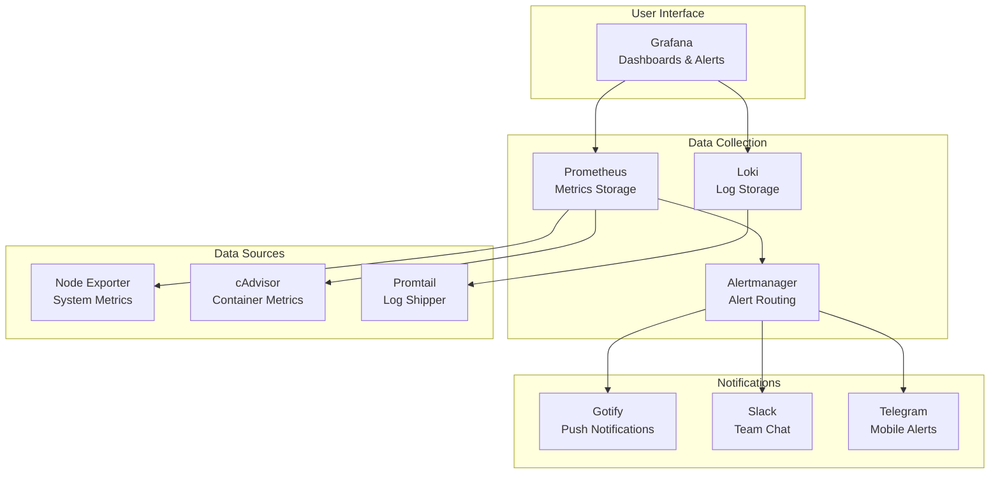

<div align="center">

# 🚀 DevOps Observability Stack

[](https://github.com/vlamay/devops-stack/actions)
[](https://opensource.org/licenses/MIT)


**Production-ready monitoring and observability stack with automated setup**

[Quick Start](#-quick-start) • [Features](#-features) • [Architecture](#-architecture) • [Docs](#-documentation)

</div>

---

## 🎯 What This Solves

Setting up a complete observability stack typically takes days. This project delivers a production-ready monitoring solution in **under 5 minutes** with:

- ✅ Pre-configured Grafana dashboards
- ✅ Multi-service monitoring (Docker, Kubernetes, System)
- ✅ Automated alerting setup
- ✅ Log aggregation with Loki
- ✅ CI/CD pipeline included

**Perfect for:** Startups, DevOps teams, SaaS companies needing instant observability.

---

## ✨ Key Features

| Feature | Description | Business Value |
|---------|-------------|----------------|
| 🚀 **One-Command Deploy** | `./start.sh` and you're live | 95% time savings |
| 📊 **Pre-built Dashboards** | 15+ ready-to-use Grafana dashboards | Zero config needed |
| 🔔 **Smart Alerting** | Multi-channel notifications (Gotify, Slack) | Faster incident response |
| 🔒 **Security Built-in** | Trivy scanning, secret detection | Production-grade security |
| 🤖 **GitHub Actions** | Automated CI/CD pipeline | Continuous reliability |

---

## 🚀 Quick Start

### Prerequisites
- Docker & Docker Compose
- 4GB RAM minimum
- Linux/macOS (Windows via WSL2)

### Installation

```bash
# Clone the repository
git clone https://github.com/vlamay/devops-stack.git
cd devops-stack

# Start the entire stack
./start.sh

# Access services:
# Grafana:    http://localhost:3000 (admin/admin)
# Prometheus: http://localhost:9090
# Loki:       http://localhost:3100
```

That's it! Full observability in under 5 minutes.

---

## 📊 Included Services

<table>
<tr>
<td width="50%">

### 📈 Monitoring
- **Prometheus** - Metrics collection
- **Grafana** - Visualization & dashboards
- **Node Exporter** - System metrics
- **cAdvisor** - Container metrics

</td>
<td width="50%">

### 📝 Logging
- **Loki** - Log aggregation
- **Promtail** - Log shipping
- **Grafana** - Log visualization

</td>
</tr>
<tr>
<td width="50%">

### 🔔 Alerting
- **Alertmanager** - Alert routing
- **Gotify** - Push notifications
- Slack/PagerDuty integration

</td>
<td width="50%">

### 🔒 Security
- **Trivy** - Vulnerability scanning
- Secret detection
- Security dashboards

</td>
</tr>
</table>

---

## 🏗️ Architecture



---

## 📖 Documentation

- [Installation Guide](docs/installation.md)
- [Configuration Options](docs/configuration.md)
- [Dashboard Guide](docs/dashboards.md)
- [Alerting Setup](docs/alerting.md)
- [Troubleshooting](docs/troubleshooting.md)

---

## 🎨 Screenshots

### Grafana Dashboard


### Alert Configuration


---

## 💼 Use Cases

### Startups & Small Teams
- Quick observability setup
- Cost-effective monitoring
- No dedicated DevOps needed

### DevOps Teams
- Standardized monitoring stack
- CI/CD integration ready
- Production deployment template

### Development Environments
- Local monitoring for dev/test
- Mirror production setup
- Debug performance issues

---

## 🔧 Advanced Configuration

### Custom Dashboards
```bash
# Add custom dashboards to:
grafana/provisioning/dashboards/custom/
```

### Alert Rules
```yaml
# Edit Prometheus rules:
prometheus/alerts/custom-rules.yml
```

### Integrations
- Slack: Configure webhook in `alertmanager.yml`
- PagerDuty: Add integration key
- Custom webhooks: Supported

---

## 📊 Metrics & Results

**Before This Stack:**
- ❌ 2-3 days setup time
- ❌ Complex configuration
- ❌ Missing dashboards
- ❌ No alerting

**After This Stack:**
- ✅ 5 minutes deployment
- ✅ Zero configuration
- ✅ 15+ pre-built dashboards
- ✅ Multi-channel alerting

**ROI:** 95% time savings = $2,000+ value for typical DevOps team

---

## 🛠️ Development

### Local Development
```bash
# Start development environment
docker-compose -f docker-compose.dev.yml up -d

# Run tests
./scripts/run-tests.sh

# Security scan
./scripts/security-scan.sh
```

### Production Deployment
```bash
# Deploy to production
./scripts/deploy-production.sh

# Monitor deployment
./scripts/monitor-deployment.sh
```

---

## 🤝 Contributing

Contributions welcome! Please:
1. Fork the repository
2. Create feature branch (`git checkout -b feature/amazing-feature`)
3. Commit changes (`git commit -m 'Add amazing feature'`)
4. Push to branch (`git push origin feature/amazing-feature`)
5. Open Pull Request

---

## 📄 License

MIT License - see [LICENSE](LICENSE) file.

---

## 🌟 Star History

[](https://star-history.com/#vlamay/devops-stack&Date)

---

## 🙏 Support

If this project saved you time, consider:
- ⭐ Starring the repository
- 🐛 Reporting bugs
- 💡 Suggesting features
- 📢 Sharing with colleagues

---

<div align="center">

**Built with ❤️ by [Vladimir Maydanov](https://github.com/vlamay)**

[LinkedIn](https://www.linkedin.com/in/maidaniuk) • [Email](mailto:vla.maydanov@icloud.com)

</div>